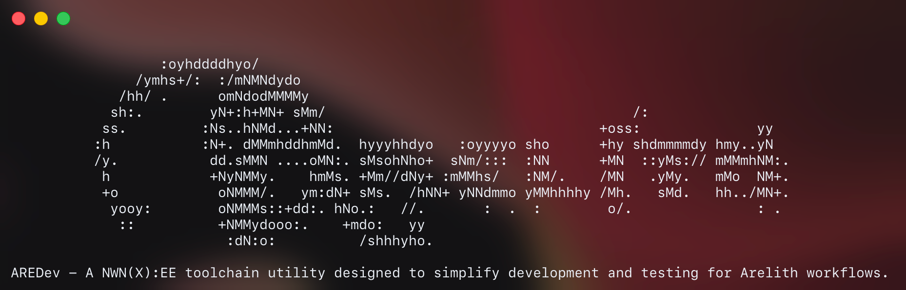

# ARE_Builder



`arebuilder` builds Neverwinter Nights: Enhanced Edition module artifacts from an AREDev-style project folder. It can scaffold a local AREDev workspace, run the interactive AREDev workflow, compile shared NWScript sources, and package module outputs for local development or Docker-backed workflows.

Builder commands use the current directory as the project root by default. In normal use, `cd` into the target AREDev folder first and run commands from there, or specify the project root via `--root [path]`.

## Requirements

- Python 3.13 or newer for native use
- Docker for Docker-backed AREDev projects
- A Neverwinter Nights: Enhanced Edition install for script compilation and server/client workflows
- AREDev resource checkouts copied or cloned into the initialized project:
  - `are-resources`
  - `<target>-resources`, such as `pgcc-resources`

## Setup

Choose an empty or existing AREDev project folder, then initialize it with either the native Python package or the published Docker image.

### Native Python

```bash
cd /path/to/AREDev
python -m pip install git+https://github.com/Kalopsia-dev/ARE_Builder.git
arebuilder init .
```

This writes the local AREDev scaffold with native builder execution enabled.

### Docker

```bash
cd /path/to/AREDev
docker pull kalopsiadev/arebuilder:latest
docker run --rm -v ".:/work" -w /work kalopsiadev/arebuilder:latest init /work --backend docker
```

This writes the same scaffold with Docker-backed builder execution enabled. Generated configuration lives in `config/arebuilder.env`; set
`NWN_INSTALL_PATH` and `NWN_HOME_PATH` there if auto-detection cannot find the right locations.

## Daily Workflow

After initialization, use the generated wrapper from the AREDev project root:

```bash
cd /path/to/AREDev
./AREDev.sh
```

On Windows, run `AREDev.bat` instead.

The wrapper opens the interactive AREDev prompt. The same workflows can also run non-interactively from the project root:

```bash
aredev compile
aredev build
aredev start
aredev stop
```

Common AREDev commands are:

| Command | Purpose |
| --- | --- |
| `compile [selector]` | Compile shared scripts, using state to rebuild only what changed unless a selector is provided. |
| `build` | Generate palettes, build the module, and link resources into the server tree. |
| `start` | Start the local AREDev test server with the configured module. |
| `stop` | Stop the AREDev test server. |
| `toolset [run]` | Sync a toolset-compatible module bundle, optionally launching the toolset. |
| `nwn [dm]` | Launch the NWN client and connect to the local server. |
| `database [drop]` | Open the test database client, or reset database state with `drop`. |
| `update` | Pull refreshed Docker images used by the scaffold. |

## Compile Command

`compile` is the main direct builder command for shared NWScript sources. It reads scripts from the shared resources tree, writes compiled `.ncs` files, and stores a state file so later runs can compile only changed scripts and affected dependents.

```bash
cd /path/to/AREDev
arebuilder compile
arebuilder compile all
arebuilder compile nw_s0_sleep
arebuilder compile 'nw_s0_*'
```

Selector behavior:

- no selector: compile changed shared scripts using the state file
- `all`: compile every shared script with an entry point
- script name or wildcard: compile matching script(s), including dependents when a selected script is an include

Default paths:

| Setting | Default |
| --- | --- |
| input scripts | `are-resources/scripts` |
| compiled output | `compiled-resources` |
| state file | `temp/script_index.json` |

Override those paths with CLI flags when running a standalone compile workflow:

```bash
arebuilder \
  --script-dir /path/to/scripts \
  --output-dir /path/to/compiled \
  --state-file /path/to/script_index.json \
  compile
```

The same settings can be provided through `SCRIPT_DIR`, `OUTPUT_DIR`, and `STATE_FILE`. If you cannot run from the project directory, use
`--root /path/to/AREDev` or set `AREDEV_ROOT=/path/to/AREDev`.

## Other Builder Commands

Most project work should go through the AREDev wrapper, but the direct
`arebuilder` CLI also exposes lower-level build steps:

| Command | Purpose |
| --- | --- |
| `arebuilder init .` | Create or refresh an AREDev project scaffold. |
| `arebuilder aredev` | Start the AREDev prompt directly. |
| `arebuilder all [target]` | Run the full build and link workflow. |
| `arebuilder quick [target]` | Rebuild fast-changing outputs and repack without regenerating palettes. |
| `arebuilder pack [target]` | Write `module.ifo` and assemble the configured archive. |
| `arebuilder palette [target] [type ...]` | Generate all palettes, or only selected palette types. |
| `arebuilder link [target]` | Create target-specific override links. |
